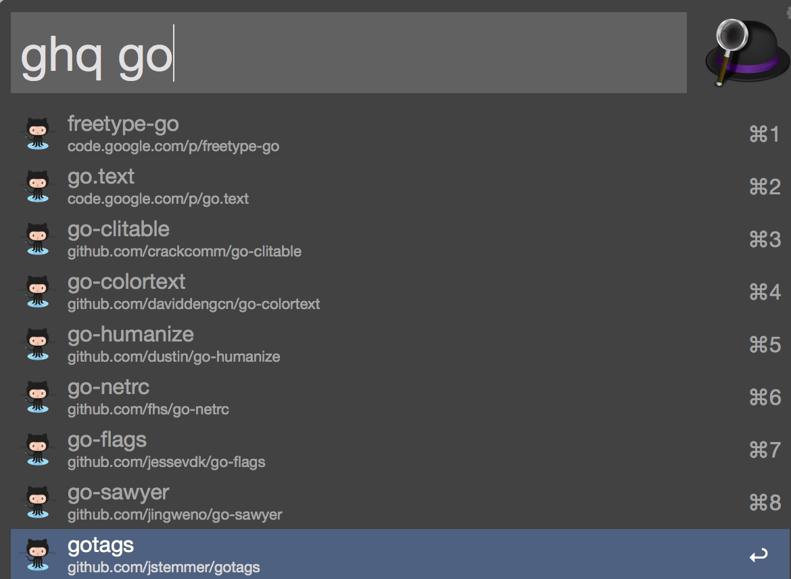

# Alfred ghq open Workflow

This is a workflow for [Alfred](http://www.alfredapp.com/). 

```ghq list``` command to display the selected repository open in browser

## Example



## Installation

Download [alfred-ghq-open-workflow](https://github.com/hatanakay/alfred-ghq-open-workflow/releases) to your computer and double click it.

## Configuration

[ghq](https://github.com/motemen/ghq) command path sets ```PATH``` environment variable to $HOME/.bashrc

```sh
export GOPATH=$HOME/go
export PATH=$PATH:$GOPATH/bin
```
## Licence

[MIT](https://github.com/hatanakay/alfred-ghq-open-workflow/blob/master/LICENSE)

## Author

[hatanakay](https://github.com/hatanakay)
